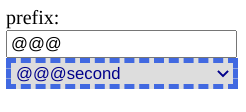

# Хорошие практики при проектировании React-компонентов
## Введение

За время работы с реактом я много раз встречался с ситуацией, когда нужный компонент уже кем-то реализован, но в то же время есть какая-то мелочь, которая не позволяет использовать этот компонент как есть. Нужно разбираться, лезть внутрь и что-то править. И даже если это удается разобраться, что к чему внутри компонента, менять зачастую этот компонент страшно. Ведь, если компонент уже кем-то написан, значит, вероятно, кем-то используется. И для этого пользователя мои правки могут стать неприятной неожиданностью.

В этой статье я напишу о практиках, которые позволяют компонентам быть гибкими и открытыми к расширению.

Для примера я напишу компонент кастомного селекта, и покажу на нем примеры.
Для начала напишу нерасширяемую версию:
```jsx
function MySelect({onClick}) {
    const [data, setData] = useState([]);
    const [error, setError] = useState(false);
    const [fetching, setFetching] = useState(false);
    const [value, setValue] = useState("");

    const handleChange = (value) => {
        setValue(value);
        onClick(value);
    };

    useEffect(() => {
        setFetching(true);
        getData()
            .then((res) => {
                setFetching(false);
                setData(res);
            })
            .catch((err) => {
                setFetching(false);
                setError(true);
            });
    }, []);

    if (fetching) {
        return <div>Please, wait...</div>;
    }

    if (error) {
        return <div>Error:(</div>;
    }

    return (
        <select value={value} onChange={(e) => handleChange(e.target.value)}>
            {data.map((item) => {
                return <option value={item.id}>{item.text}</option>;
            })}
        </select>
    );
}
```

Стили

```css
.MySelect {
    margin: 10px;
    width: 200px;
    border: 4px dashed royalblue;
    color: darkblue
}
```

Я создал компонент, внутри него делаю запрос за данными, отрисовываю селект вместе
с данными, предварительно стилизовав его.

Такой компонент работает, но в будущем его будет тяжело переиспользовать и изменять.

## Развязываю данные и представление

Первое, что бросается в глаза - данные завязаны с представлением. Я могу переиспользовать компонент с одним набором
данных. А что если мне нужно использовать точно такой же компонент в разных местах приложения с разными данными?

Поэтому, я разделю компонент `<MySelect/>` на 2: в одном получаю данные, в другом отрисовываю.

```jsx
export default function MySelectContainer({onChange}) {
    // ...
    return <MySelect items={data} value={value} onChange={handleChange}/>;
}

function MySelect({items, value, onChange}) {
    return (
        <select
            className="MySelect"
            value={value}
            onChange={(e) => onChange(e.target.value)}
        >
            {items.map((item) => {
                return <option value={item.id}>{item.text}</option>;
            })}
        </select>
    );
}
```

## Открытость компонента для расширения

Теперь я могу использовать `MySelect` с разными наборами данными.

Однако, мой компонент все еще закрыт для расширения. Я реализовал ровно тот функционал, который необходим сейчас. Но при
малейшем изменении функциональных требований мне придется модифицировать компонент. Хорошо было бы реализовать компонент
так, чтобы любой пользователь компонента мог решить свою задачу, и ему бы не пришлось менять код внутри компонента.

А что конкретно может понадобиться пользователю компонента?

Например, в существующий компонент никак нельзя обработать фокус или блюр.

Другим примером закрытости для расширения является передача в коллбэк только нового значения, а не события. Переедавая
только мы не сможем узнать информацию о событии, а также повлиять на его поведение.

```js
function MySelect({items, ...props}) {
    return (
        <select
            {...props}
            className={clsx("MySelect", props.className)}
        >
            {items.map((item) => {
                return <option key={item.id} value={item.id}>{item.text}</option>;
            })}
        </select>
    );
}
```

Обратите внимание, что некоторые пропсы могут пересекаться с предустановленными атрибутами внутри компонента. Тем не
менее следует предоставить возможность прокинуть пропс(например, как в примере выше `className`).

## Позиционирование компонента снаружи

Когда я вставляю элемент в дерево элементов, между ним и другими элементами наверняка будут отступы. Но не нужно
стилизовать внешние отступы внутри компонента. И, если возможно, то и размеры компонента тоже не нужно хардкодить в
стилях точными пиксельными значениями. Конкретный контейнер, в который будет вставляться элемент, будет правильно
позиционировать и задавать нужные размеру дочернему, задав ему нужные размеры и позицию.

```css
.MySelect {
    width: 100%;
    border: 4px dashed royalblue;
    color: darkblue
}
```

## Гибкость использования `children`

А что если нам надо прокинуть пропсы не только в `<select/>`, но и в `<option/>`?

Я могу добавить в список пропсов `optionProps`, но может понадобиться и другая кастомизация. Например, иконка до или
после текста внутри `<option/>` или что-то еще. Все варианты предугадать сложно.

Решить эту проблему можно, если задавать `<option/>`
через `children`.

```js
function MySelect({children, ...props}) {
    return (
        <select {...props} className={clsx("MySelect", props.className)}>
            {children}
        </select>
    );
}

<MySelect value={value} onChange={handleChange}>
    {data.map((item) => {
        return <option key={item.id} value={item.id}>{item.text}</option>;
    })}
</MySelect>
```

Теперь в `<option/>` можно прокинуть что угодно, ведь элементы доступны снаружи `<MySelect/>`

### Выделение логики в кастомный хук

А что если `<MySelect />` и `<option />`  должны делить общее состояние? Мне помогут кастомные хуки и
паттерн `Prop getter`!

Для демонстрации расширим функционал `<MySelect/>`. Допустим, внутри `<MySelect/>` нужна возможность ввести в `<input/>` префикс
для `<option/>`



В этом случае мне понадобится общий стейт для префикса.

Вынесу его в кастомный хук.

```jsx
const useMySelect = () => {
    const [prefix, setPrefix] = useState("");
    return {
        prefix,
        setPrefix
    };
};
```

Доработаю `<MySelect>`, так чтобы он мог обрабатывать префикс. Вынесу `<option>` в отдельный компонент.

```jsx
function Option({children, prefix, ...props}) {
    return (
        <option {...props} className={clsx("Option", props.className)}>
            {prefix}
            {children}
        </option>
    );
}

function MySelect({children, onPrefixChange, prefixValue, ...props}) {
    return (
        <>
            <label>
                prefix:
                <input type="text" onChange={onPrefixChange} value={prefixValue}/>
            </label>
            <select {...props} className={clsx("MySelect", props.className)}>
                {children}
            </select>
        </>
    );
}

function MySelectContainer() {
    const {prefix, setPrefix} = useMySelect();

    return (
        <MySelect
            className="MySelect"
            value={value}
            onChange={handleChange}
            prefixValue={prefix}
            onPrefixChange={(e) => setPrefix(e.target.value)}
        >
            {data.map((item) => {
                return (
                    <Option key={item.id} value={item.id} prefix={prefix}>
                        {item.text}
                    </Option>
                );
            })}
        </MySelect>
    );
}
```

Я разделил состояние между компонентами, но у такого подхода все еще есть недостатки. У компонентов появляются новые
пропсы, и чтобы завести компоненты, нужно приложить больше усилий. Нужно разбираться что куда прокидывать, нужно писать
больше кода.

Устранить эти недостатки мне поможет паттерн `Prop getter`.

## `Prop getter`

Внутри `useMySelect` напишем геттеры пропсов для компонентов

```jsx
const useMySelect = () => {
    const [prefix, setPrefix] = useState("");

    const getSelectProps = (props) => ({
        ...props,
        onPrefixChange: (e) => {
            if (props.onPrefixChange) {
                props.onPrefixChange(e);
            }
            setPrefix(e.target.value);
        },
        prefixValue: props.prefixValue ? props.prefixValue : prefix
    });

    const getOptionProps = (props) => ({
        ...props,
        prefix: props.prefixValue ? props.prefixValue : prefix
    });

    return {
        getSelectProps,
        getOptionProps
    };
};
```

Геттер пропсов - это функция, которая принимает в качестве аргумента пропсы компонента и расширяет их, согласно нужной
логике. В моем примере, они добавляют пропсы для обработки префикса.

```jsx

const {getOptionProps, getSelectProps} = useMySelect();
return (
    <MySelect
        {...getSelectProps({
            value,
            onChange: handleChange,
        })}
    >
        {data.map((item) => {
            return (
                <Option key={item.id} {...getOptionProps({value: item.id})}>
                    {item.text}
                </Option>
            );
        })}
    </MySelect>
)
```

Обратите внимание, что на примере выше пользователь нашего компонента вообще ничего не знает про префикс, что упрощает работу с дефолтным поведением `<MySelect/>`. В то же время у пользователя есть возможность менять пропсы / реализовывать свою логику, когда это необходимо.

## Бонус: получение данных

Давайте вернемся к получению данных. За него отвечает в моем примере следующий кусок кода:
```jsx
    const [data, setData] = useState([]);
    const [error, setError] = useState(false);
    const [fetching, setFetching] = useState(false);

    useEffect(() => {
        setFetching(true);
        getData()
            .then((res) => {
                setFetching(false);
                setData(res);
            })
            .catch((err) => {
                setFetching(false);
                setError(true);
            });
    }, []);
```

Я считаю использование булевых переменных `fetching` и `error` плохой практикой.
И вот по каким причинам:
- По этим переменным нельзя точно сказать, в каком состоянии находятся сейчас получение данных. Если `fetching=false` и `error=false`, то это запрос прошел успешно, или мы еще не отправляли запрос? Непонятно. Можно возразить, что в случае успешного запроса придут данные сервера, но это происходит далеко не всегда)
- `error` и `fetching` взаимозависимы, не может быть ситуации `error=true` и `fetching=true` - это невозможное состояние, которое можно задать в коде.

Хорошей практикой будет описание состояния с помощью строковых литералов: `initial`, `fetching`, `success`, `error`

Такой подход решает обе проблемы: я знаю однозначно текущее состояние, и никак не могу определить невозможное состояние.

Код:
```jsx
  const [data, setData] = useState([]);
  const [state, setState] = useState('initial');
  
  const { getOptionProps, getSelectProps } = useMySelect();

  useEffect(() => {
    setState('fetching');
    getData()
      .then((res) => {
        setState('done');
        setData(res);
      })
      .catch((err) => {
        setState('error')
      });
  }, []);

  if (state === 'fetching') {
    return <div>Please, wait...</div>;
  }

  if (state === 'error') {
    return <div>Error:(</div>;
  }
```


